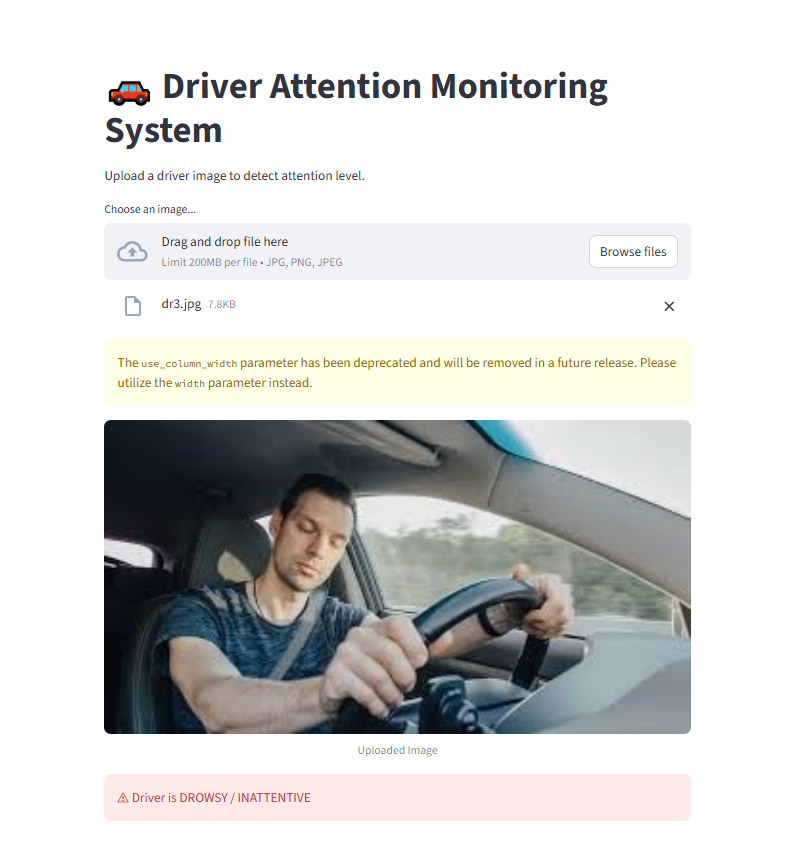

## 1. Project Title

**Intelligent Driver Attention Monitoring System Using Deep Learning**

---

## 2. Project Description

The Intelligent Driver Attention Monitoring System is a deep learning-based application designed to detect whether a driver is attentive or drowsy. The system uses a Convolutional Neural Network (CNN) model trained on driver image datasets to classify driver behavior.

This project aims to improve road safety by detecting driver fatigue and inattention. The system analyzes driver images and predicts whether the driver is in an attentive or drowsy state. A Streamlit-based interface allows users to upload images and receive real-time predictions from the trained model.

---

## 3. Features

* Driver attention detection using deep learning
* Convolutional Neural Network (CNN) model for image classification
* Detection of driver state: **Attentive** or **Drowsy**
* Streamlit-based interactive user interface
* Image upload for prediction
* Real-time prediction results

---

## 4. Technologies Used

* Python
* TensorFlow / Keras
* OpenCV
* NumPy
* Streamlit
* Deep Learning (CNN)

---

## 5. Dataset

The dataset used in this project consists of driver images categorized into two classes:

* **Attentive** – Images of drivers who are alert and focused.
* **Drowsy** – Images of drivers showing signs of fatigue or sleepiness.

The images were preprocessed and resized before being used to train the CNN model. The dataset was divided into training and validation sets to evaluate model performance.

---

## 6. Project Structure

Driver-Attention-Monitoring-System/

├── train/
├── val/
├── app.py
├── driver_attention_model.h5
├── outputs/
│   └── prediction_result.png
├── requirements.txt
└── README.md

---

## 7. Installation

1. Clone the repository

git clone https://github.com/shahlaparakkottil/DL.git

2. Navigate to the project folder

cd DL

3. Install required dependencies

pip install -r requirements.txt

---

## 8. How to Run

Run the Streamlit application using the following command:

streamlit run app.py

Then open the local Streamlit URL in your browser to upload images and test the model.

---

## 9. Output

The system predicts the driver's attention state based on the uploaded image.

Possible predictions:

* **Attentive**
* **Drowsy**

The prediction result is displayed in the Streamlit interface.

Example output screenshot:

---

## 10. Future Improvements

* Real-time driver monitoring using webcam
* Audio alert system for drowsy detection
* Improved deep learning model accuracy
* Integration with vehicle safety systems
* Mobile application support

---

## Author

Shahla
AI / Machine Learning Enthusiast
